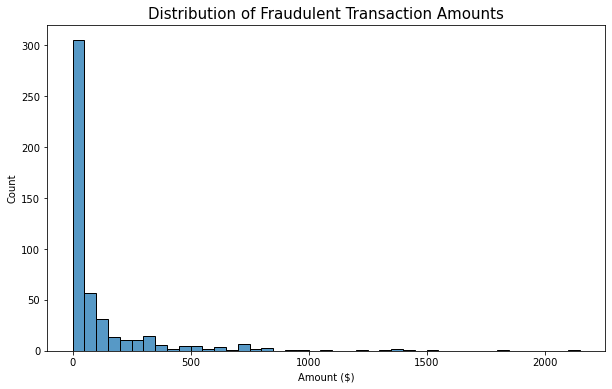
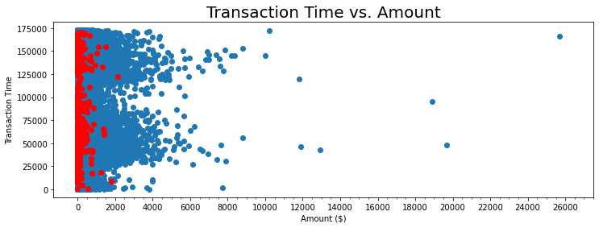
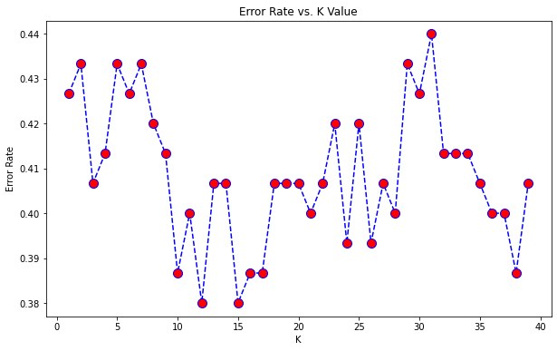

# Credit Card Fraud Detection Machine Learning

The data was downloaded from Kaggle:https://www.kaggle.com/mlg-ulb/creditcardfraud

The dataset contains transactions made by European credit cardholders credit cards in September 2013. This dataset presents transactions that occurred in two days, where we have 492 frauds out of 284,807 transactions. The dataset is highly unbalanced, the positive class (frauds) account for 0.172% of all transactions.

It contains only numeric input variables which are the result of a PCA transformation. Unfortunately, due to confidentiality issues, the original features and more background information about the data are unavailable. Features V1, V2, … V28 are the principal components obtained with PCA, the only features which have not been transformed with PCA are 'Time' and 'Amount'. Feature 'Time' contains the seconds elapsed between each transaction and the first transaction in the dataset. The feature 'Amount' is the transaction Amount, this feature can be used for example-dependent cost-sensitive learning. Feature 'Class' is the response variable and it takes value 1 in case of fraud and 0 otherwise.

The dataset has been collected and analysed during a research collaboration of Worldline and the Machine Learning Group (http://mlg.ulb.ac.be) of ULB (Université Libre de Bruxelles) on big data mining and fraud detection.

## Goal

The objective is to classify the data transactions as either legitimate (class 0) or fradulent (class 1) using a machine learning model. Four machine learning models will be trained and tested to determine which will yield the best results:

- Decision Trees
- Random Forest
- K Nearest Neighbours
- K Means Clustering


```python
import pandas as pd
import numpy as np
import matplotlib.pyplot as plt
import seaborn as sns
%matplotlib inline
```


```python
#Read the file
cards = pd.read_csv('creditcard.csv')
```


```python
cards.head()
```


<div>
<style scoped>
    .dataframe tbody tr th:only-of-type {
        vertical-align: middle;
    }

    .dataframe tbody tr th {
        vertical-align: top;
    }

    .dataframe thead th {
        text-align: right;
    }
</style>
<table border="1" class="dataframe">
  <thead>
    <tr style="text-align: right;">
      <th></th>
      <th>Time</th>
      <th>V1</th>
      <th>V2</th>
      <th>V3</th>
      <th>V4</th>
      <th>V5</th>
      <th>V6</th>
      <th>V7</th>
      <th>V8</th>
      <th>V9</th>
      <th>...</th>
      <th>V21</th>
      <th>V22</th>
      <th>V23</th>
      <th>V24</th>
      <th>V25</th>
      <th>V26</th>
      <th>V27</th>
      <th>V28</th>
      <th>Amount</th>
      <th>Class</th>
    </tr>
  </thead>
  <tbody>
    <tr>
      <th>0</th>
      <td>0.0</td>
      <td>-1.359807</td>
      <td>-0.072781</td>
      <td>2.536347</td>
      <td>1.378155</td>
      <td>-0.338321</td>
      <td>0.462388</td>
      <td>0.239599</td>
      <td>0.098698</td>
      <td>0.363787</td>
      <td>...</td>
      <td>-0.018307</td>
      <td>0.277838</td>
      <td>-0.110474</td>
      <td>0.066928</td>
      <td>0.128539</td>
      <td>-0.189115</td>
      <td>0.133558</td>
      <td>-0.021053</td>
      <td>149.62</td>
      <td>0</td>
    </tr>
    <tr>
      <th>1</th>
      <td>0.0</td>
      <td>1.191857</td>
      <td>0.266151</td>
      <td>0.166480</td>
      <td>0.448154</td>
      <td>0.060018</td>
      <td>-0.082361</td>
      <td>-0.078803</td>
      <td>0.085102</td>
      <td>-0.255425</td>
      <td>...</td>
      <td>-0.225775</td>
      <td>-0.638672</td>
      <td>0.101288</td>
      <td>-0.339846</td>
      <td>0.167170</td>
      <td>0.125895</td>
      <td>-0.008983</td>
      <td>0.014724</td>
      <td>2.69</td>
      <td>0</td>
    </tr>
    <tr>
      <th>2</th>
      <td>1.0</td>
      <td>-1.358354</td>
      <td>-1.340163</td>
      <td>1.773209</td>
      <td>0.379780</td>
      <td>-0.503198</td>
      <td>1.800499</td>
      <td>0.791461</td>
      <td>0.247676</td>
      <td>-1.514654</td>
      <td>...</td>
      <td>0.247998</td>
      <td>0.771679</td>
      <td>0.909412</td>
      <td>-0.689281</td>
      <td>-0.327642</td>
      <td>-0.139097</td>
      <td>-0.055353</td>
      <td>-0.059752</td>
      <td>378.66</td>
      <td>0</td>
    </tr>
    <tr>
      <th>3</th>
      <td>1.0</td>
      <td>-0.966272</td>
      <td>-0.185226</td>
      <td>1.792993</td>
      <td>-0.863291</td>
      <td>-0.010309</td>
      <td>1.247203</td>
      <td>0.237609</td>
      <td>0.377436</td>
      <td>-1.387024</td>
      <td>...</td>
      <td>-0.108300</td>
      <td>0.005274</td>
      <td>-0.190321</td>
      <td>-1.175575</td>
      <td>0.647376</td>
      <td>-0.221929</td>
      <td>0.062723</td>
      <td>0.061458</td>
      <td>123.50</td>
      <td>0</td>
    </tr>
    <tr>
      <th>4</th>
      <td>2.0</td>
      <td>-1.158233</td>
      <td>0.877737</td>
      <td>1.548718</td>
      <td>0.403034</td>
      <td>-0.407193</td>
      <td>0.095921</td>
      <td>0.592941</td>
      <td>-0.270533</td>
      <td>0.817739</td>
      <td>...</td>
      <td>-0.009431</td>
      <td>0.798278</td>
      <td>-0.137458</td>
      <td>0.141267</td>
      <td>-0.206010</td>
      <td>0.502292</td>
      <td>0.219422</td>
      <td>0.215153</td>
      <td>69.99</td>
      <td>0</td>
    </tr>
  </tbody>
</table>
<p>5 rows × 31 columns</p>
</div>


```python
cards.columns
```


    Index(['Time', 'V1', 'V2', 'V3', 'V4', 'V5', 'V6', 'V7', 'V8', 'V9', 'V10',
           'V11', 'V12', 'V13', 'V14', 'V15', 'V16', 'V17', 'V18', 'V19', 'V20',
           'V21', 'V22', 'V23', 'V24', 'V25', 'V26', 'V27', 'V28', 'Amount',
           'Class'],
          dtype='object')


# Checking for Missing Values


```python
#Checking the entire data frame for missing values
cards.isna().any().any()
```


    False


# Exploratory Data Analysis

In this stage, we will examine the data to identify any patterns, trends and relationships between the variables. It will help us analyze the data and extract insights that can be used to make decisions.

Data Visualization will give us a clear idea of what the data means by giving it visual context.

## Class


```python
#Creating a correlation dataframe 
cc = cards.corr() 

#Identifying the correlation of the other variables to Class
cc["Class"].sort_values()
```


    V17      -0.326481
    V14      -0.302544
    V12      -0.260593
    V10      -0.216883
    V16      -0.196539
    V3       -0.192961
    V7       -0.187257
    V18      -0.111485
    V1       -0.101347
    V9       -0.097733
    V5       -0.094974
    V6       -0.043643
    Time     -0.012323
    V24      -0.007221
    V13      -0.004570
    V15      -0.004223
    V23      -0.002685
    V22       0.000805
    V25       0.003308
    V26       0.004455
    Amount    0.005632
    V28       0.009536
    V27       0.017580
    V8        0.019875
    V20       0.020090
    V19       0.034783
    V21       0.040413
    V2        0.091289
    V4        0.133447
    V11       0.154876
    Class     1.000000
    Name: Class, dtype: float64


V17 and V14 have a low negative correlation with Class while all the other variables have a negligible correlation with class.

Note: Typically, a correlation value between 0.3-0.5 (either positive or negative) is considered to be a low correlation and anything below that is negligible.

## Amount

### Fraudulent Transaction Amount


```python
#Creating a dataframe with all the fraud transactions
fraud_cards = cards[cards['Class']==1]

fraud_cards['Amount'].describe().round(2)
```


    count     492.00
    mean      122.21
    std       256.68
    min         0.00
    25%         1.00
    50%         9.25
    75%       105.89
    max      2125.87
    Name: Amount, dtype: float64


```python
fig_dims = (10, 6)
fig, ax = plt.subplots(figsize=fig_dims)
sns.histplot(x=fraud_cards['Amount'], binwidth=50)
plt.title("Distribution of Fraudulent Transaction Amounts", fontsize=15)
ax.set_xlabel("Amount ($)")
```


    Text(0.5, 0, 'Amount ($)')


    

    


```python
fig_dims = (12, 4)
fig, ax = plt.subplots(figsize=fig_dims)
ax.scatter(y='Time',x='Amount', data=cards)
ax.scatter(y='Time',x='Amount', data=fraud_cards,facecolor="red")
major_xticks = np.arange(0, 28000, 2000)
minor_xticks = np.arange(0, 28000, 500)
ax.set_xticks(major_xticks)
ax.set_xticks(minor_xticks, minor = True)
ax.set_xlabel("Amount ($)")
ax.set_ylabel("Transaction Time")
ax.set_title('Transaction Time vs. Amount',fontsize=20)
```


    Text(0.5, 1.0, 'Transaction Time vs. Amount')


    

    


#### Fraud Amount: Key Takeaways
- The average fraud amount is <b>\$122.21</b>
- The standard deviation is <b>\$256.68</b>, which is quite large which indicates that the fraud amount can vary significantly.
- The majority of fraudulent transactions are between <b>zero and \$50</b>
- There frauds occur at various times but overall the majority of fraudulent transactions appear to be <b>under \$1000.</b> 

# Train and Test the Model

In this stage we will separate our dataset into training data that will be used to train the model and testing data that will be used to judge the accuracy of the results. We will now train and test the four machine learning models to determine which will yield the best results:

- Decision Trees
- Random Forest
- K Nearest Neighbours
- K Means Clustering


```python
#Calculating the number of frauds/legitimate transactions in the dataset
cards['Class'].value_counts()
```


    0    284315
    1       492
    Name: Class, dtype: int64


```python
#Calculating the percentage of frauds/legitimate transactions in the dataset
round((cards['Class'].value_counts()/len(cards))*100,2)
```


    0    99.83
    1     0.17
    Name: Class, dtype: float64


As seen above, only about 0.17% of the data is associated with fraudulent transactions. In order to train and test machine learning models, we need a balanced dataset. Therefore, we will create a balanced dataset from a subset of the data and train and test our model on that data. 

## Creating a Balanced Dataset

We have 492 fraudulent transactions. We will choose 250 transactions at random from these transactions and 250 transactions from the at random from the legitimate transactions to create a data set with 500 transactions. 


```python
#Creating a new balanced datset with 250 fraudulent transactions
cards_bal = cards[cards['Class']==1].sample(n=250)

#Adding 250 legitimate transactions
cards_bal = cards_bal.append(cards[cards['Class']==0].sample(n=250))
```


```python
#Calculating the percentage of frauds/legitimate transactions in the dataset
round((cards_bal['Class'].value_counts()/len(cards_bal))*100,2)
```


    1    50.0
    0    50.0
    Name: Class, dtype: float64


We now have a balanced dataset to work with.

## Train Test Split


```python
from sklearn.model_selection import train_test_split

X = cards_bal.drop('Class',axis=1)
y = cards_bal['Class']
X_train, X_test, y_train, y_test = train_test_split(X, y, test_size=0.30)
```

## Decision Trees

### Training a Decision Tree Model


```python
#Import DecisionTreeClassifier
from sklearn.tree import DecisionTreeClassifier

#Create an instance of DecisionTreeClassifier() called dtree and fit it to the training data.
dtree = DecisionTreeClassifier()
dtree.fit(X_train,y_train)
```


    DecisionTreeClassifier()


### Decision Tree: Predictions and Evaluation


```python
decision_trees_predictions = dtree.predict(X_test)
```

## Random Forests

### Training the Random Forest Model


```python
#Create an instance of the RandomForestClassifier class and fit it to our training data
from sklearn.ensemble import RandomForestClassifier

#n_estimators is the number of trees in the forest
rfc = RandomForestClassifier(n_estimators=100)

rfc.fit(X_train,y_train)
```


    RandomForestClassifier()


### Random Forests: Predictions and Evaluation


```python
random_forests_predictions = rfc.predict(X_test)
```

## K-Nearest Neighbours

### Selecting a K Value


```python
#Import KNeighbours Classifier
from sklearn.neighbors import KNeighborsClassifier

#K represents the Number of neighbors to use for kneighbors queries, we will loop over a range of values to determine which K value is best suited for this model
#Creating an empty dataframe to store the values
error_rate_df = pd.DataFrame(columns=['K', 'Error Rate'])

# Will take some time
for i in range(1,40):
    
    knn = KNeighborsClassifier(n_neighbors=i)
    knn.fit(X_train,y_train)
    pred_i = knn.predict(X_test)
    error_rate=np.mean(pred_i != y_test)   
    df = {'K':i, 'Error Rate':error_rate}
    error_rate_df = error_rate_df.append(df, ignore_index = True)
```


```python
plt.figure(figsize=(10,6))
plt.plot(error_rate_df['K'],error_rate_df['Error Rate'],color='blue', linestyle='dashed', marker='o',
         markerfacecolor='red', markersize=10)
plt.title('Error Rate vs. K Value')
plt.xlabel('K')
plt.ylabel('Error Rate')
```


    Text(0, 0.5, 'Error Rate')


    

    


```python
k = error_rate_df[error_rate_df['Error Rate'] == min(error_rate_df['Error Rate'])]['K']

#It is possible there may be multiple k values
if len(k)>1:
    #In case there are multiple k values we resent the index and select the first k value
    k = k.reset_index()
    k = int(k["K"][0])
else:
    k = int(k)

print("The error rate appears to be the lowest when k =", k,"Let's train the model with this k value.")
```

    The error rate appears to be the lowest when k = 12 Let's train the model with this k value.
    

### Training KNN Model


```python
#Create an instance of the KNN classifier and fit it to our training data
knn = KNeighborsClassifier(n_neighbors=k)
knn.fit(X_train,y_train)
```


    KNeighborsClassifier(n_neighbors=12)


### KNN: Predictions and Evaluations


```python
knn_predictions = knn.predict(X_test)
```

## K Means Clustering

### Training the K Means Model


```python
#Importing K Means classifier
from sklearn.cluster import KMeans

#Create an instance of the K Means classifier and fit it to our training data
#We only have two target values 1 and 0 so we set the number of clusters to 2
kmeans = KMeans(n_clusters=2)
kmeans.fit(X_train,y_train)
```


    KMeans(n_clusters=2)


### K Means: Predictions and Evaluations


```python
kmeans_predictions = kmeans.fit_predict(X_test)
```

## Comparing Performance

Now that we have trained four different models we can compare their performance to determine which model should be applied to the original dataset.


```python
#Import Classification Report and Confusion Matrix
from sklearn.metrics import classification_report,confusion_matrix

#Converting each of the classification reports into dictionaries
report_dt = classification_report(y_test,decision_trees_predictions , output_dict=True)
report_rf = classification_report(y_test,random_forests_predictions , output_dict=True)
report_knn = classification_report(y_test,knn_predictions, output_dict=True)
report_kmeans = classification_report(y_test,kmeans_predictions, output_dict=True)
```


```python
model = {'Model Name':['Decision Trees', 'Random Forests','KNN','K-Means'],
        'Accuracy':[report_dt['accuracy'], report_rf['accuracy'], report_knn['accuracy'], report_kmeans['accuracy']],
        'Precision':[report_dt['weighted avg']['precision'],report_rf['weighted avg']['precision'], report_knn['weighted avg']['precision'], report_kmeans['weighted avg']['precision']],
        'Recall':[report_dt['weighted avg']['recall'],report_rf['weighted avg']['recall'],report_knn['weighted avg']['recall'],report_kmeans['weighted avg']['recall']],
        'F1-Score':[report_dt['weighted avg']['f1-score'],report_rf['weighted avg']['f1-score'],report_knn['weighted avg']['f1-score'],report_kmeans['weighted avg']['f1-score']]}

model = pd.DataFrame(model)

model.round(2).sort_values(by=['Accuracy','Precision','Recall','F1-Score'],ascending=False)
```


<div>
<style scoped>
    .dataframe tbody tr th:only-of-type {
        vertical-align: middle;
    }

    .dataframe tbody tr th {
        vertical-align: top;
    }

    .dataframe thead th {
        text-align: right;
    }
</style>
<table border="1" class="dataframe">
  <thead>
    <tr style="text-align: right;">
      <th></th>
      <th>Model Name</th>
      <th>Accuracy</th>
      <th>Precision</th>
      <th>Recall</th>
      <th>F1-Score</th>
    </tr>
  </thead>
  <tbody>
    <tr>
      <th>1</th>
      <td>Random Forests</td>
      <td>0.89</td>
      <td>0.89</td>
      <td>0.89</td>
      <td>0.89</td>
    </tr>
    <tr>
      <th>0</th>
      <td>Decision Trees</td>
      <td>0.87</td>
      <td>0.87</td>
      <td>0.87</td>
      <td>0.87</td>
    </tr>
    <tr>
      <th>2</th>
      <td>KNN</td>
      <td>0.62</td>
      <td>0.62</td>
      <td>0.62</td>
      <td>0.62</td>
    </tr>
    <tr>
      <th>3</th>
      <td>K-Means</td>
      <td>0.42</td>
      <td>0.41</td>
      <td>0.42</td>
      <td>0.41</td>
    </tr>
  </tbody>
</table>
</div>


As seen above the <b>Random Forests Model</b> yields the best results so we will test the model against the original data from the original dataset to compare its performance.


```python
X = cards.drop('Class',axis=1)
y = cards['Class']

#Random Forests predictions
random_forests_predictions = rfc.predict(X)

#Assigning the classification report to a dictionary to call later
cards_cr = classification_report(y,random_forests_predictions, output_dict=True)

print(classification_report(y,random_forests_predictions))
```

                  precision    recall  f1-score   support
    
               0       1.00      0.96      0.98    284315
               1       0.04      0.93      0.07       492
    
        accuracy                           0.96    284807
       macro avg       0.52      0.95      0.53    284807
    weighted avg       1.00      0.96      0.98    284807
    
    


```python
cards_accuracy = round(cards_cr['accuracy'],2)

print('The Random Forests Model has an accuracy of',cards_accuracy)
```

    The Random Forests Model has an accuracy of 0.96
    

Overall, the Random Forests Model does the best job of predicting fraudulent credit card transactions.
